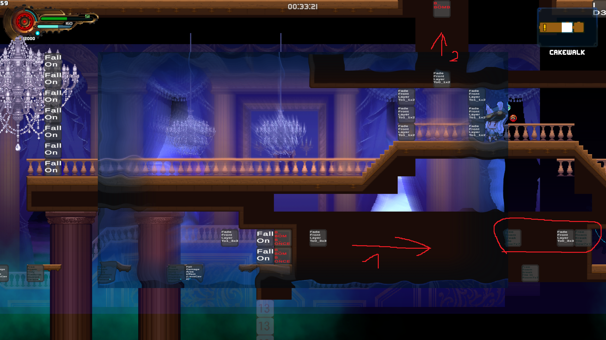

# Early Valhalla:

# Tartarus:

# Snow Veil:

# Blushwood

# Ulvosa

Drop a Crossbomb from above to destroy the breakable blocks

Carry a Explosive Orb to bottom left Wall and use Crossbomb + ChargeShot

# Sinner's Oath
Entrance from Maga Deapth

Either enter the Main area of Sinner's Oath with charge shot,

or trigger the Eventblock from the above Picture, but the camera has to scroll up before triggering the event, to enable this Path to Cyril fight and Illusion Palace

# Illusion Palace
Chargeshotless

